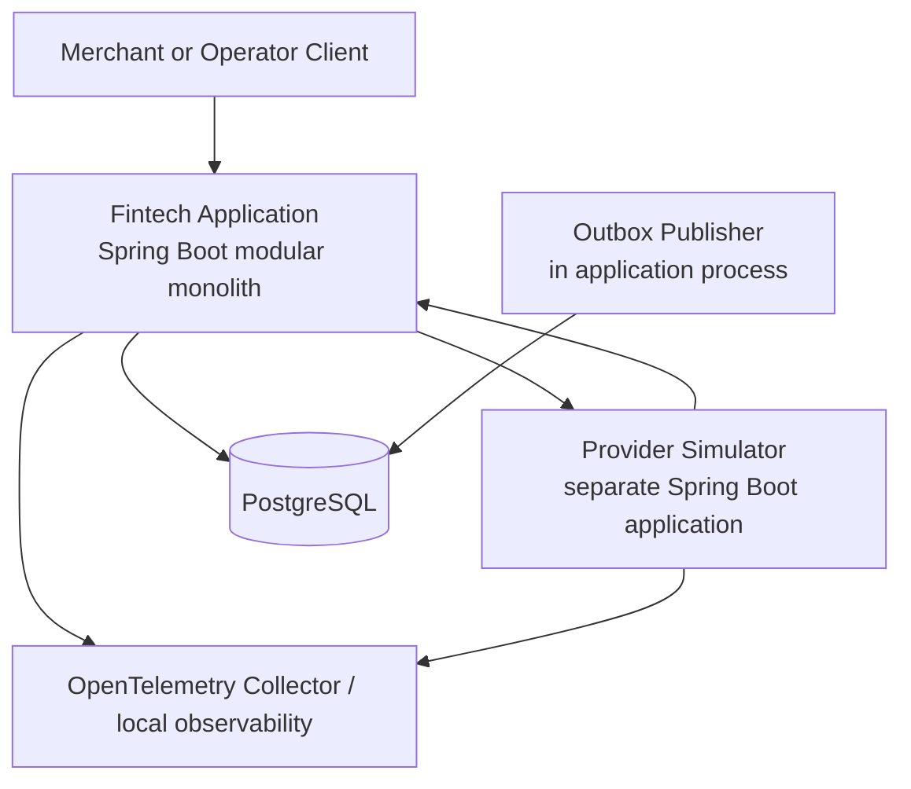
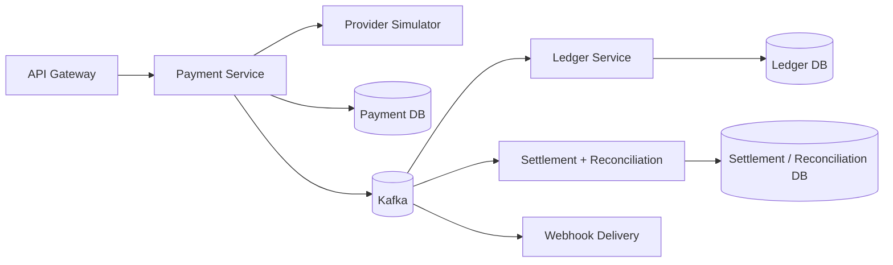

# Container Design

## Stage 1 — implementation baseline

### Fintech application modules

- Identity and merchant authorization.
- Payment.
- Ledger.
- Settlement, initially skeletal.
- Reconciliation, initially skeletal.
- Outbox.
- Audit and observability.

### Boundary rules

- Modules expose application interfaces, not repositories.
- A module cannot write another module’s tables directly.
- Payment owns payment lifecycle; Ledger owns posting rules.
- Stage 1 may coordinate Payment and Ledger in one PostgreSQL transaction because both are in one deployable and database.
- Extraction must not preserve cross-schema table access; it will move to commands/events and reconciliation.

## Stage 2 — target distributed shape

Stage 2 is conditional. Extraction requires measured operational or ownership need, not résumé appearance.
