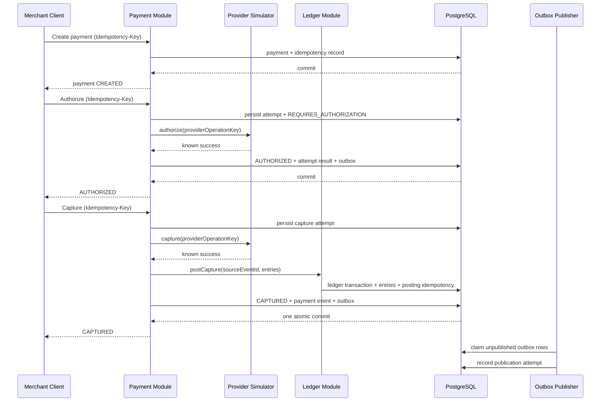

# First Vertical Slice

## Goal

Demonstrate one complete, correct, observable flow from merchant command to provider attempt to ledger evidence.

## Sequence

## Transaction boundaries

- Create is one local database transaction.
- Provider HTTP calls are never held inside a database transaction.
- Attempt intent is persisted before provider invocation.
- Known provider success is applied in a new transaction.
- In Stage 1, payment state, ledger posting, and outbox insertion for capture commit atomically in one PostgreSQL transaction across owned schemas.
- A lost provider response produces `CAPTURE_UNKNOWN`; the system does not post the ledger until authoritative success evidence exists.

## Definition of complete

- Happy path works through public API.
- Lost-response scenario produces unknown state.
- Duplicate client requests and provider callbacks are safe.
- Ledger transaction balances and is immutable.
- Timeline connects command, attempt, provider reference, posting, and event.
- Traces and metrics explain latency and failures.
