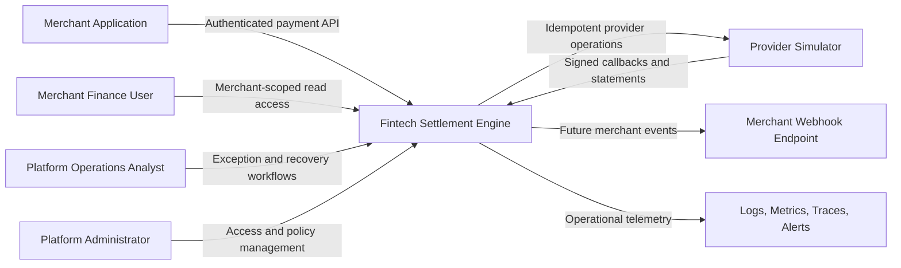

# System Context

## System responsibilities

The platform owns:

- payment lifecycle;
- provider attempt history;
- immutable ledger;
- settlement calculation and payout state;
- reconciliation evidence and resolutions;
- idempotency and event publication;
- merchant isolation and audit.

The provider simulator owns:

- simulated external operation result;
- provider operation reference;
- provider event IDs;
- configurable delay, loss, duplication, and ordering scenarios;
- simulated provider statements.

The platform never delegates authorization, tenant isolation, ledger correctness, or operator permissions to the provider simulator.
