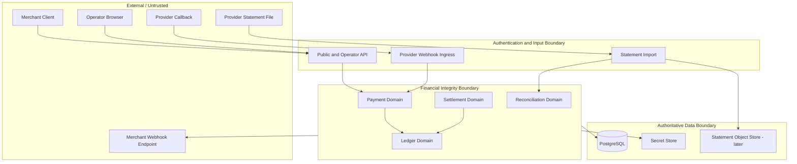

# Trust Boundaries

## Boundary rules

### External to API

Treat all values as attacker-controlled. Authenticate, authorize, validate schema, enforce size and rate limits, canonicalize idempotency inputs, and assign ownership from the principal.

### Provider callback ingress

Verify signature, timestamp, replay window, event schema, provider identity, and event-ID uniqueness before domain processing.

### Payment to Ledger

Only a typed posting command may cross the boundary. Payment cannot insert ledger entries or select arbitrary accounts.

### Reconciliation to Payment or Ledger

Reconciliation supplies evidence and a conclusion command. It cannot mutate history or bypass aggregate invariants.

### Domain to data

Use least-privilege database roles. Committed ledger entry update/delete is denied. Secrets are referenced, never copied to general tables.

### Outbound webhook delivery

Treat destination as hostile. Apply SSRF protection, DNS/IP revalidation, egress allow/deny policy, bounded response size, timeout, signing, and retry limits.
